<h1>Tiny</h1>
<h2>COMP JU+TE R</h2>
<h3><a href="https://hc-ddr.hucki.net/wiki/lib/exe/fetch.php/tiny:jutecomp1.pdf">Zeitschrift Jugend und Technik 1988</a></h3>
<h3><a href="https://hc-ddr.hucki.net/wiki/lib/exe/fetch.php/tiny/buch.pdf">Buch Tiny</a></h3>
<a target=""

Schlagworte: Tiny, Comp JU+TE r, DDR, 1988, Jugend und Technik, Zeitschrift, Rechner, Computer, 4k

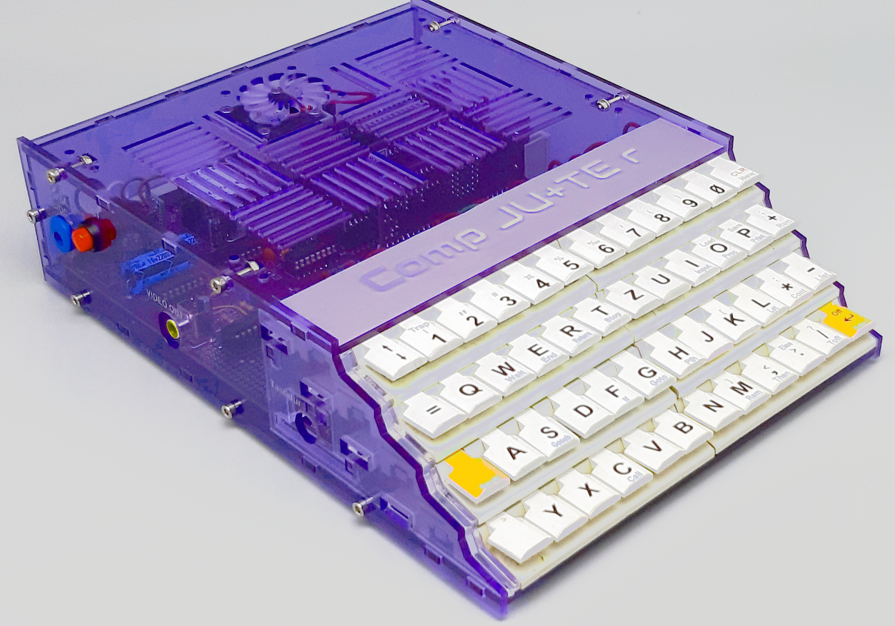

Auch 35 Jahre nach Erscheinen der Artikel in des Zeitschrift Jugend und Technik werden noch "COMP JU+TE R" gebaut.
 Mir sind 2 Fälle bekannt. Beide Geräte sind lauffähig und beruhen auf der 4k-Version. Grundlage war die
 Anleitung im Buch "Tiny".

In meinem Gerät kamen Speichermodule vom Typ C zum Einsatz. Diese Steckkarte lässt sich mit 8k RAM und 8k
 EPROM bestücken. Zusätzlich wurde eine weitere Karte vom Typ C verbaut, die nur mit 8kByte RAM bestückt ist.
 Somit stehen 16k RAM zur Verfügung. Davon muss der Bildspeicher abgezogen werden. 
Im Gerät befindet sich eine 3. Steckkarte, auf der ein 512kByte ROM verbaut ist. Um den Adressbereich zu erweitern,
 wurde ein Zähler eingesetzt. Dieser ROM wird als ROM-Bank benutzt und beherbergt eine Datenbank mit Programmen
 für dieses Gerät. 
Verzichtet wurde bei meinem Gerät auf Erweiterungen, wie Tonbandanschluss und mehr.

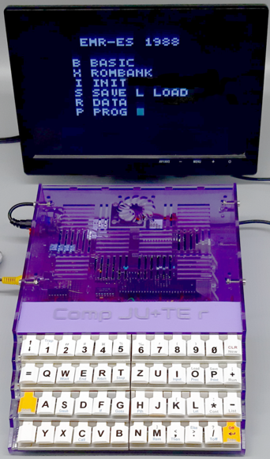

### Bilderverzeichnis:

  <table border="0">
<!-- ------------------------------ -->
    <tr>
      <td>
        
      </td>
      <td>
        <ul>
          <li>Vorderansicht</li>
        </ul>
      </td>
    </tr>
<!-- ------------------------------ -->
    <tr>
      <td>
        <a href="./Bilder/vorne_links.png">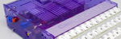</a>
      </td>
      <td>
        <ul>
          <li>Ansicht vorne links</li>
        </ul>
      </td>
    </tr>
<!-- ------------------------------ -->
    <tr>
      <td>
        <a href="./Bilder/vorne_oben.png">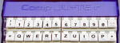</a>
      </td>
      <td>
        <ul>
          <li>Ansicht vorne oben</li>
        </ul>
      </td>
    </tr>
<!-- ------------------------------ -->
    <tr>
      <td>
        <a href="./Bilder/Startbild.png">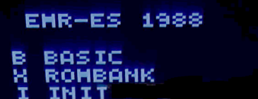</a>
      </td>
      <td>
        <ul>
          <li>Startbild</li>
        </ul>
      </td>
    </tr>
<!-- ------------------------------ -->
    <tr>
      <td>
        
      </td>
      <td>
        <ul>
          <li>Turm von Hanoi</li>
        </ul>
      </td>
    </tr>
<!-- ------------------------------ -->
    <tr>
      <td>
        <a href="./Bilder/links.png">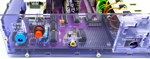</a>
      </td>
      <td>
        <ul>
          <li>Netzanschluss Hohlbuchse 2,1/5,5</li>
          <li>Resettaster</li>
          <li>Compositanschluss</li>
        </ul>
      </td>
    </tr>
<!-- ------------------------------ -->
    <tr>
      <td>
        <a href="./Bilder/innen_hinten.png">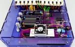</a>
      </td>
      <td>
        <ul>
          <li>Innenansicht von hinten</li>
        </ul>
      </td>
    </tr>
<!-- ------------------------------ -->
    <tr>
      <td>
        <a href="./Bilder/innen_vorn_oben.png">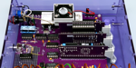</a>
      </td>
      <td>
        <ul>
          <li>Innenansicht von vorn oben</li>
        </ul>
      </td>
    </tr>
<!-- ------------------------------ -->
    <tr>
      <td>
        <a href="./Bilder/Speicherkarten.png">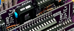</a>
      </td>
      <td>
        <ul>
          <li>Speicherkarten</li>
        </ul>
      </td>
    </tr>
<!-- ------------------------------ -->
    <tr>
      <td>
        
      </td>
      <td>
        <ul>
          <li>Platinenhalter</li>
        </ul>
      </td>
    </tr>
<!-- ------------------------------ -->
    <tr>
      <td>
        <a href="./Bilder/Prozessor_Luefter.png">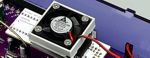</a>
      </td>
      <td>
        <ul>
          <li>Prozessor L&uuml;fter</li>
        </ul>
      </td>
    </tr>
<!-- ------------------------------ -->
    <tr>
      <td>
        <a href="./Bilder/Leiterplatte_Hauptplatine_oben.png">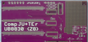</a>
      </td>
      <td>
        <ul>
          <li>Hauptleiterplatte</li>
        </ul>
      </td>
    </tr>
<!-- ------------------------------ -->
    <tr>
      <td>
        <a href="./Bilder/Leiterplatte_Tastatur.png">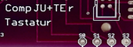</a>
      </td>
      <td>
        <ul>
          <li>Leiterplatte Tastatur</li>
        </ul>
      </td>
    </tr>
<!-- ------------------------------ -->
    <tr>
      <td>
        <a href="./Bilder/Leiterplatte_ROM_RAM.png">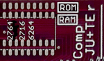</a>
      </td>
      <td>
        <ul>
          <li>Leiterplatte ROM RAM</li>
        </ul>
      </td>
    </tr>
<!-- ------------------------------ -->
    <tr>
      <td>
        <a href="./Bilder/Leiterplatte_ROM_BANK.png">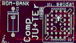</a>
      </td>
      <td>
        <ul>
          <li>Leiterplatte ROM BANK</li>
        </ul>
      </td>
    </tr>
<!-- ------------------------------ -->
    <tr>
      <td>
        
      </td>
      <td>
        <ul>
          <li>UB8821 Best&uuml;ckungsseite</li>
        </ul>
      </td>
    </tr>
<!-- ------------------------------ -->
    <tr>
      <td>
        <a href="./Bilder/UB8821_unten.png">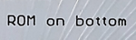</a>
      </td>
      <td>
        <ul>
          <li>UB8821 Leiterseite</li>
        </ul>
      </td>
    </tr>
<!-- ------------------------------ -->
  </table>

